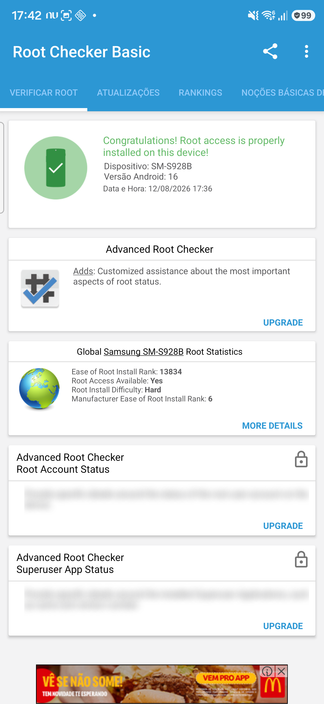

# SM-S928B / S928BXXS6DZF2 porting record

Port of the Galaxy S24 Ultra International firmware support to the
Root-My-Galaxy-Payloads project, derived from the SM-S928U1 DZF2 profile (see
`SM-S928U1-S928U1UES6DZF2.md`). Hardware validation is partial; Manager and
persistent/control-channel validation remain pending.

## Evidence

| Field | Value |
| --- | --- |
| Package model | `SM-S928B` (ZTO multi-CSC) |
| AP/PDA package | `S928BXXS6DZF2` |
| Device codename | `e3q` |
| Product name | `e3qxxx` |
| Android build ID | `BP4A.251205.006` |
| Build fingerprint | `samsung/e3qxxx/e3q:16/BP4A.251205.006/S928BXXS6DZF2:user/release-keys` |
| Kernel release | `6.1.145-android14-11-33419968-abS928BXXS6DZF2` |

## Kernel chain

| Object | Size (bytes) | SHA-256 |
| --- | ---: | --- |
| AP `boot.img.lz4` | — | discovered from `AP_S928BXXS6DZF2_..._meta_OS16.tar.md5` |
| Decompressed `boot.img` | 100,663,296 | `4db3978e1cabab0b6d49c4b0ceb285454b93420c6b0b8c929e0fcd73899d24bc` |
| Raw kernel payload | 38,005,248 | `6e77adc6e22bd0c57299f62884b014e132f14cbfe45d88794a4525ace2e030d5` |
| Recovered `vmlinux.elf` | 43,070,883 | — |
| Extracted `vmlinux.btf` | 5,981,643 | `8415104c012e18942b18bcb52f401075cb6b92df837b9552a8c11070d65efe56` |

The raw kernel size is identical to the S928U1 DZF2 kernel. The recovered BTF
SHA-256 is byte-identical to the S928U1 DZF2 BTF, so every structure layout
used by the exploit is identical.

## Symbol audit vs SM-S928U1 DZF2

All 23 required symbols were recovered from this firmware's `vmlinux.elf`
(with base `0xffffffc008000000`) and match the S928USQS6DZF2 offsets exactly,
including `worker_thread`, `ashmem_miscs`, `loggers`, `nfulnl_logger`,
`init_task`, and `sysctl_bootid`.

The `random_table` `boot_id` `.data` slot at `0x023762f0` holds the same
`SYSCTL_BOOTID` pointer. The `nfulnl_logger` object is at `0x02242a20` with
its first qword pointing at the `"nfnetlink_log"` name string at kernel offset
`0x016a622a` — the single offset that differs from the US DZF2 value
(`0x016a61b8`). Therefore:

```c
#define SLIDE_NFULNL_LOGGER_OFF 0x016a622aULL
```

## P0 fingerprint table

The 32 candidate rows were regenerated from the raw S928B kernel and are
byte-identical to the checked-in `e3q-S928USQS6DZF2` table (32/32 rows matched
at offsets `0x000` through `0xe00` per candidate slide).

## Profile

`src/targets/e3q-S928BXXS6DZF2/` contains the target header and the identical
P0 fingerprint table. The header differs from the S928U1 profile only in the
build variant label, the build fingerprint, the `P0_FINGERPRINT_HEADER` path,
and `SLIDE_NFULNL_LOGGER_OFF`.

## Payload build

Built with Android NDK on Windows (clang `aarch64-linux-android35`, `-Oz`,
`APP_S928_STABLE_RACE=1`), padded to 104,128 bytes:

```text
artifacts/e3q-S928BXXS6DZF2/cve-2026-43499-app.so
size 104128
SHA-256 a49b378d654c7e637697a701c3c4c5fd02d22b9b30a7069c03e64ec5844af206
```

## KernelSU late-load module

KernelSU v3.2.5 (commit `b0bc817b4e966aa6aa830834eaf6ef765d821d40`) patched
with the repository's Samsung KDP/RKP/DEFEX patch, built in the DDK container
`ghcr.io/ylarod/ddk-min:android14-6.1-20260313` with the generated release
replaced by the exact target release:

```text
vermagic: 6.1.145-android14-11-33419968-abS928BXXS6DZF2 SMP preempt mod_unload modversions aarch64
```

`check_symbol` passes against the recovered S928B `vmlinux.elf`. The manual
relocation audit reports 202 undefined imports, 0 missing from the target
symbol table, an empty `__versions` section, and 0 CRC mismatches. The Samsung
no-patch-text path is enabled, so the module has no `stop_machine` import. The
module was stripped (`398,432` bytes), embedded in `ksud` as the
`android14-6.1_kernelsu.ko` asset, and `ksud` rebuilt with NDK.

| File | Size (bytes) | Purpose |
| --- | ---: | --- |
| `kernelsu/android14-6.1_kernelsu-e3q-S928BXXS6DZF2-kdp.ko` | 398,432 | exact-release no-patch-text module |
| `kernelsu/ksud-e3q-S928BXXS6DZF2-kdp` | 4,748,232 | late-load binary embedding the module |

```text
android14-6.1_kernelsu-e3q-S928BXXS6DZF2-kdp.ko
SHA-256 14f805c6a03123e84f10a252eb5b47f6c65c56c05ad4ccccf1f836c6867f64a9

ksud-e3q-S928BXXS6DZF2-kdp
SHA-256 43f451313dc111429187f8f93e76c57c42976323782aac936c1c09aa309b76b3
```

## Support

Feed updated in `targets-v3.json` (payload `e3q-S928BXXS6DZF2`, models
`SM-S928B`, kernel `6.1.145`) and mirrored in `targets-v2.json`.

## Hardware validation

The exact S928B DZF2 device reached bootstrap root on exploit attempt 7:

```text
root umh result wake=1 complete=1 retval=0 socket=1
```

The replacement no-patch-text `ksud` then loaded the embedded module without a
reboot. KernelSU logged `kernelsu.ko loaded successfully!` and entered
`u:r:ksu:s0`; `/proc/modules` reported `kernelsu` and the boot ID remained
unchanged. KernelSU Manager then reported `Working <LKM> [Jailbreak mode]`,
version `32525-2`, one superuser, the exact S928B kernel release, and SELinux
Enforcing. The screenshot is checked in as
`SM-S928B-S928BXXS6DZF2-KernelSU.png`. The root is still per-boot because no
boot image was modified; persistent boot survival remains untested. The
previous live-patching pair triggered the watchdog before this replacement.


Root Checker Basic also reported `Root access is properly installed` for
`SM-S928B`:


